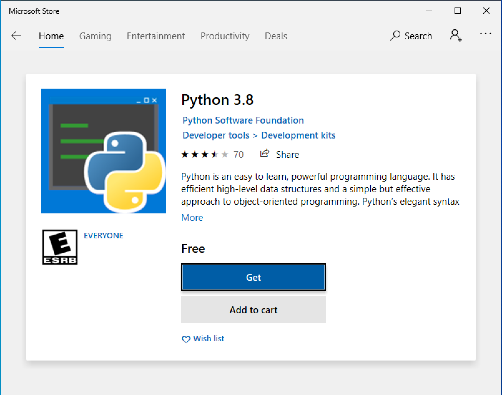
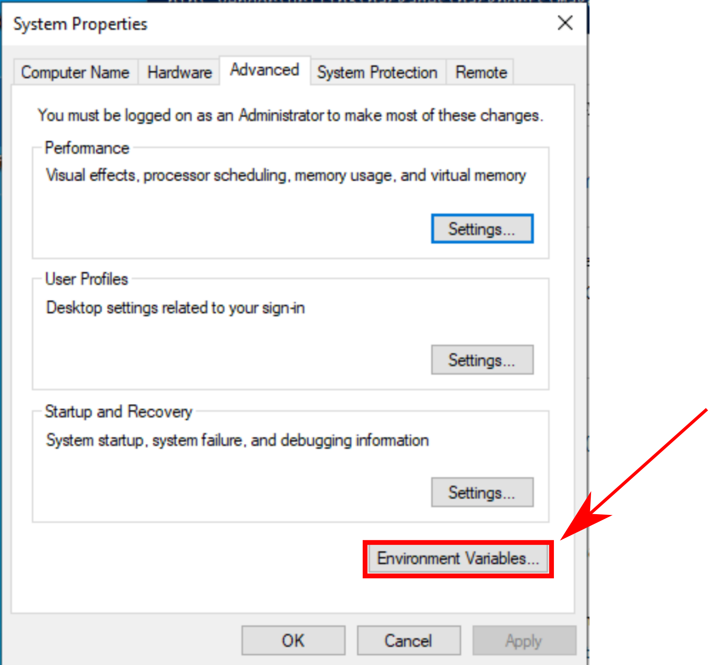

# Installing Python On Pipenv Windows

You can either install python from the Microsoft Store or from the python
website. It is recommended to install the Microsoft Store as it is better
integrated into the system.

## Actually Installing Python

#### Installing from the Microsoft Store
Open up the microsoft store and use the search to find python. Below is a
screenshot of the install for python 3.8. By the way it may ask you to sign
after you click "Get" but you don't actually need to.

#### Installing from python.org
Simply go to the [downloads page](https://www.python.org/downloads/) and pick
the version of python you want.

### Checking the install
To see if python is working go to the command line (either Command Prompt or
Powershell) and type in `python`. If you installed from python.org it may be the
case that ypu have to use `python.exe` instead of `python`. Either way, you
should get something that looks like the screenshot below. Type in `exit()` to
quit.

## Setting Your Environment Variables

### Background
You can install a bunch of different programs with python. For instance, later
on we will be installing a program called Pipenv. Python puts that program into
a "Scripts" folder, however, by default windows doesn't know where that
"Scripts" folder is. Windows has an environment variable called "Path" that is a
list of folders. When you try to run a program like Pipenv windows will look
for a program called "Pipenv" in every folder in the Path variable. So what we
need to do is add the "Scripts" folder to the Path variable.

### Finding the Scripts folder
Unfortunately, the easiest way to find the Scripts folder is to install
something. Note for all the following commands, if `pip` doesn't work you may
have to use `pip.exe` instead.
1. Install Pipenv by running the command `pip install pipenv`
2. Run `pip show pipenv`. That will print out a bunch of
information about the package.
3. Find the `Location` heading It will be something like
   `C:\Blah\blah\site-packages`. The location is boxed in the screenshot below.

The folder we want is `C:\Blah\blah\Scripts`. So in the example screenshot above
the scripts folder is
`c:\users\me\appdata\local\packages\pythonsoftwarefoundation.python.3.8_qbz5n2kfra8p0\localcache\local-packages\python38\Scripts`

### Adding the Scripts folder to the Path
1. Open the Control Panel
2. Navigate to System and Security -> System
3. On the left hand side click the option that says "Advanced System Settings".
4. At this point a window should open. It should look like the one below. Click
   "Environment Variables"
    
5. Under "User variables for <your username>" select Path (so it's highlighted)
   then click "Edit"
6. Add in the path to the scripts folder as a new entry.
7. Click OK until you are back at the Control Panel

At this point any new terminals that you open should have the updated Path

### Check the path
There are two ways to check. One is to simply type `pipenv`. If the command runs
then everything is good! If it doesn't then check that path variable with the
following command: `Get-Item -Path Env:Path | Select -ExpandProperty Value`.
That command will print out a semi-colon separated list of directories. Your
Scripts folder should be among them.
